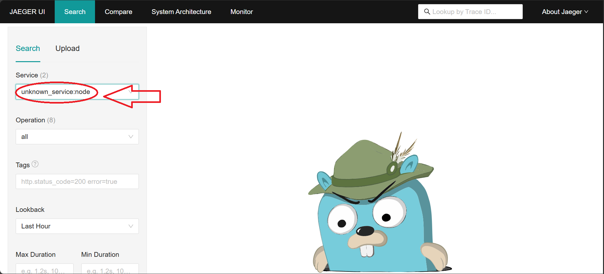
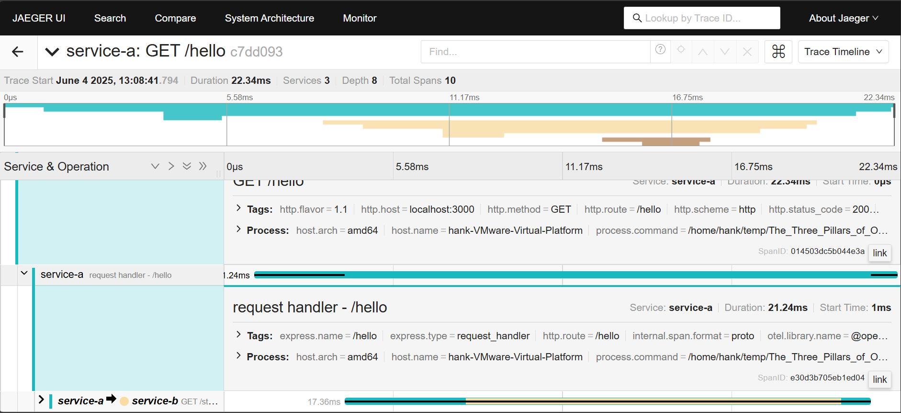

# 微服務觀測性 (Observability for Microservices)
---
### 第 1 章	什麼是觀測性？
### 第 2 章	搭建本地微服務
### 第 3 章	加入 Tracing：OpenTelemetry + Jaeger
### 第 4 章	加入 Metrics：Prometheus + Exporter
### 第 5 章	加入 Logs：Loki + Grafana 日誌串流
### 第 6 章	統一儀表板：Grafana 整合三大支柱
### 第 7 章	警報系統設計：Prometheus + Alertmanager
### 第 8 章	總結：打造一個可擴充的監控架構
---
## __第 1 章 什麼是觀測性？__
---
#### *1.1觀測性（Observability）來自控制工程領域，意思是：*

從系統輸出的訊號，推斷其內部運作狀況的能力。

通俗地講，就像你不需要打開電腦機箱，也能透過 CPU 使用率、風扇轉速和功耗等數據，推斷出電腦內部的溫度變化

**監控 (Monitoring) 與 觀測性 (Observability) 的區別：**
| 類別   | 說明                             | 重點                                 |             差異             |
| :----- | :------------------------------- | :----------------------------------- | :--------------------------- |
| 監控   | 收集與呈現預期內的系統狀況（例如 CPU、記憶體） | 有既定監控項目         | **面對已知問題的反應能力**   |
| 觀測性 | 能在未知錯誤發生時，快速找到發生地點與原因 | 面對未知問題的探索能力     | **面對未知問題的探索能力**   |

監控像是體檢表，觀測性像通靈你需要預想有機會發生的事

#### *1.2. 観測性的三大支柱（The Three Pillars）*
| 支柱名稱            | 功能說明         | 常見用途          | 工具範例                                    |
| --------------- | ------------ | ------------- | --------------------------------------- |
| **Metrics（指標）** | 數值型、可量化的系統狀態 | 偵測趨勢、設計告警     | Prometheus、Grafana                      |
| **Logs（日誌）**    | 系統事件的文字紀錄    | 錯誤分析、除錯追蹤     | Loki、ELK（Elasticsearch、Logstash、Kibana） |
| **Traces（追蹤）**  | 跨服務之間的請求流程紀錄 | 微服務呼叫鏈、效能瓶頸定位 | OpenTelemetry、Jaeger、Zipkin             |

#### *1.3 實作的架構（示意圖）*

<pre><code>
                  +----------------------+
                  |     Grafana          |
                  |(視覺化：圖表/追蹤/日誌) |
                  +----------+-----------+
                             |
            +-------------------------------+
            |            Prometheus         |
            | (抓 metrics + 發警報 + 查詢)  |
            +----------+----------+---------+
                       |          |
         +-------------+          +------------+
         |                                      |
+--------v---------+                  +--------v--------+
|   Node Exporter  |                  |   OpenTelemetry |
| (系統資源監控)  |                  |  SDK + Collector |
+------------------+                  +--------+--------+
                                               |
                      +------------------------+----------------+
                      |                         |                |
              +-------v------+         +--------v------+  +------v-------+
              |  Service A   |         |  Service B   |  |  Service C    |
              +--------------+         +---------------+ +---------------+
                  |                        |                  |
               Logs/Trace             Logs/Trace         Logs/Trace
                  |                        |                  |
              +---v------------------------v------------------v---+
              |                     Loki + Jaeger                |
              +--------------------------------------------------+

</code></pre>
---
### ___第 2 章 搭建本地微服務___
用 Node.js（Express）建立三層微服務，並模擬請求從 A → B → C 的流程，為追蹤系統（Tracing）鋪路

---
#### *2.1 目錄結構*
<pre><code>
microservices-demo/
├── service-a/
│   └── index.js
├── service-b/
│   └── index.js
├── service-c/
│   └── index.js
└── docker-compose.yml   # （第 3 章會開始用）

</code></pre>
---
#### *流程圖*
<pre><code>
[ 使用者請求 ]
       |
   [Service A] #A：接收 /hello，呼叫 B 並包裝回傳
       |
   [Service B] #B：處理 /step2，呼叫 C 並包裝回傳
       |
   [Service C] #C：處理 /step3，單純回應資料
       |
   回傳結果 → 使用者
</code></pre>

#### *2.2  啟動與測試*
每個服務都裝上 Express：
<pre><code>
cd service-a && npm init -y && npm i express axios
cd ../service-b && npm init -y && npm i express axios
cd ../service-c && npm init -y && npm i express
</code></pre>
接著:
<pre><code>
# 開三個終端機
node service-a/index.js
node service-b/index.js
node service-c/index.js
</code></pre>
測試：
<pre><code>
GET http://localhost:3000/hello
# 回傳內容： A → B → C
</code></pre>
---
### __第 3 章 加入 Tracing：OpenTelemetry + Jaeger__
---
#### *3.1. 要用到的工具*

| 工具                                    | 功能                | 備註           |
| ------------------------------------- | ----------------- | ------------ |
| `@opentelemetry/sdk-node`             | Node.js 的核心觀測 SDK | 每個服務都裝       |
| `@opentelemetry/instrumentation-http` | 自動追蹤 HTTP 呼叫      |              |
| `@opentelemetry/exporter-jaeger`      | 將資料匯出到 Jaeger     |              |
| Jaeger                                | 可視化請求流向的 UI       | 我們用 Docker 起 |

#### *3.2 加入 Jaeger 到 docker-compose*

<pre><code>
version: '3'
services:
  jaeger:
    image: jaegertracing/all-in-one:1.49
    ports:
      - "16686:16686"  # UI
      - "4318:4318"    # OTLP HTTP 預設 port
</code></pre>

啟動：
<pre><code>
docker-compose up -d
#打開 Jaeger UI：
#http://localhost:16686注意如果使用的是虛擬機，要在宿主機上訪問網站localhost就是虛擬機的IP + :16686)
</code></pre>

#### *3.3. 在每個 Service 加入 Tracing*
建立 tracing.js（每個 service 目錄都需要）
### **service-a/tracing.js 有範例**
---
#### 安裝依賴（每個 service 都要）
<pre><code>
npm install \
  @opentelemetry/sdk-node \
  @opentelemetry/auto-instrumentations-node \
  @opentelemetry/exporter-trace-otlp-http
</code></pre>
#### 啟動三個服務：
`node service-a/index.js`、`node service-b/index.js`、`node service-c/index.js`
<pre><code>
發送請求給 A：
curl http://localhost:3000/hello
</code></pre>
---
### 如圖到Jaeger 的網頁去查看service運作

### ___第 4 章 加入 Metrics：Prometheus + Exporter___
---
#### 4.1. 架構總覽
<pre><code>
        +-------------+
        |  Grafana    | ←── 可視化監控圖表
        +-------------+
              ↑
        +-------------+
        | Prometheus  | ←── 抓 /metrics
        +-------------+
          ↑     ↑     ↑
        A       B     C     ← 每個服務都有 /metrics endpoint

</code></pre>

